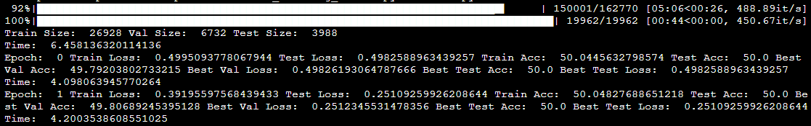

# Feature Learning, Neural Feature Ansatz, and Neural Feature Machines

## Contributors

```
Ethan Shapiro (enshapir@ucsd.edu)
Abel Seyoum (aseyoum@ucsd.edu)
```

## What's contained in this repo?

- **Training Code**: There is training to verify that the Neural Feature Ansatz (NFA) holds as well as Neural Feature Matrix (NFM) and Gradient Outer Product (GOP) correlate on various different image classifications tasks.
- **Exploration Notebook**: The exploration notebook generates correlations from the trained models to verify NFA as well as generates images to see how the NFM and GOP are similar.

## How to use this repo

### Setup

Depending on the system type (windows or mac/linux) you will need to install the correct `requirments.txt`. Regardless of system type, the version of python using during training is in the `.python-version` = `python 3.11.5`.

Next, navigate to the `CODE` folder of the repository.

The datasets used in the different training regiments are contained in `dataset.py`. The datasets can be downloaded by specifying the `download=True` flag inside the get calls to various datasets. The datasets will download to the directory `datasets` within the same location that `dataset.py` is located.

To run training, open the `run.py` file to where you'll find the following configuration parameters:

- **num_epochs**: Number of epochs for training
- **learning_rate**: The rate of learning
- **weight_decay**: The decoy of weights
- **init**: The initialization of the model
- **optimizer**: Which opitmizer to use
- **freeze**: Whether to freeze the model
- **width**: The width of each layer
- **depth**: The number of layers in the model
- **act**: The activation function to use

There are also other portions of configuration that are specific to the dataset being trained. Different dataset loaders require different parameters. For example, for the CelebA dataset we will need to specify the feature index that we want to train on. More specific details about each dataset loading function can be found in the `dataset.py`. Which feature corresponding to what index can be determined from the file named `CelebA Feature Index Mapping.txt` The main training regiment can be found below.

```
NUM_CLASSES = 2
DATASET_NAME = 'celeba'

trainloader, valloader, testloader = dataset.get_celeba(
feature_idx=38, split_percentage=0.8, num_train=150_000, num_test=20_000)

accuracies = trainer.train_network(trainloader, valloader, testloader, NUM_CLASSES,
name=get_name(DATASET_NAME, configs), configs=configs)
```

### Running training

After you've successfully configured everything, you can simply run the script in the terminal using `python run.py`.

### Verify training is working correctly?

After starting the training, you should get outputs for loading the datasets and then training epochs like below.

<p align="center">

</p>

At the end of the training, you will get an output that looks similar to below.

```
Best Training Accuracy: 99.99
Best Validation Accuracy: 99.99
Best Testing Accuracy:99.99
```

You should also expect three `.pth` files to be present in the directory `saved_nns`. One should start with `init`, another ends with `final` and one that has neither. These three files are necessary to use the exploration notebook.

**NOTE: If training multiple models with the same parameters, move the other `.pth` files to a different folder before training. We suggest naming that folder the name of the feature you trained on and the feature index.**

## Exploring the Outputs

To explore the outputs, please take a look at the `Exploration.ipynb` notebook. Within the notebook there is the necessary explaination and code to look at the outputs of our trained models.
